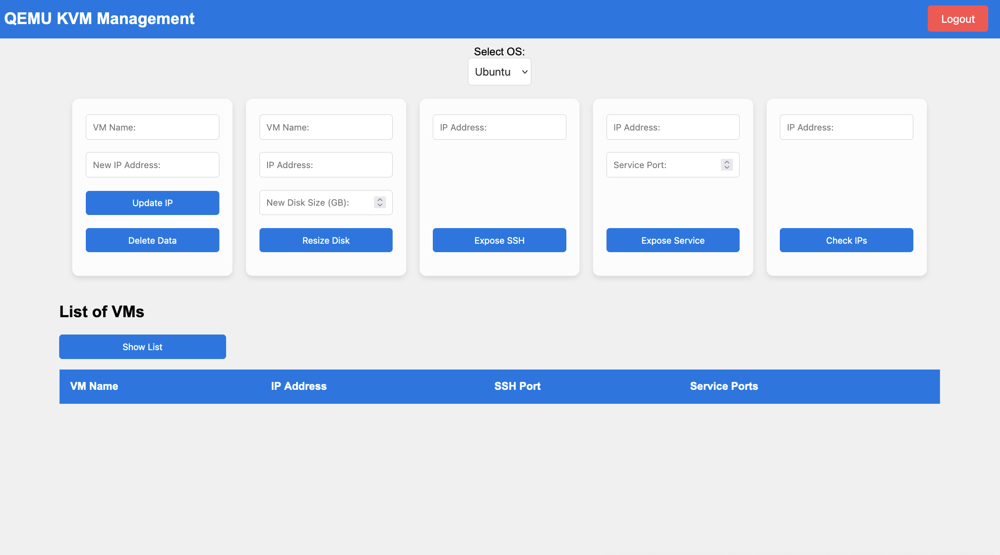

# Qemu KVM Management


**KVM-UI** tools for manage Virtual Machine in Qemu KVM, this have some features: 
- **Update IP and Hostname** after clone Virtual Machine template
- **Resize Disk** Virtual Machine
- **Expose SSH** Virtual Machine (This expose random port to public)
- **Expose Service** Virtual Machine (This expose service inside Virtual Machine to public with random port)
- **Check IPs Address** already used or not
- **List All VMs** this get from database

## How to Install
Requirements:
- [Node.js](https://nodejs.org/en/download/) v22
- [npm](https://docs.npmjs.com/cli/) 10
- [git](https://pm2.keymetrics.io/)
- [Logtail](https://betterstack.com/logs)
- Database Postgres
- Redis

### Non-Docker
- Clone this repo
- Create Tables **instances** and **users** in postgres
- 
```bash
cd kvm-ui

# Install Package
npm install

# Start Service
node index.js
```
- Now you can access in browser `localhost:3000`

### Docker Compose
- Copy `.env-example` to `.env`
```bash
cp .env-example .env
```
- Update and Ajust value in `.env`
- Make sure value `REDIS_USER` and `REDIS_PASSWORD` same in file `script/redis.conf`
- Run Container
```bash
docker compose up -d
```
- Now you can access in browser `localhost:3000`

### Create User
- Next Run this commnad for create users
```bash
curl -X POST -H "Content-Type: application/json" -d '{"username": "admin", "password": "randompassword"}' http://localhost:3000/register
```